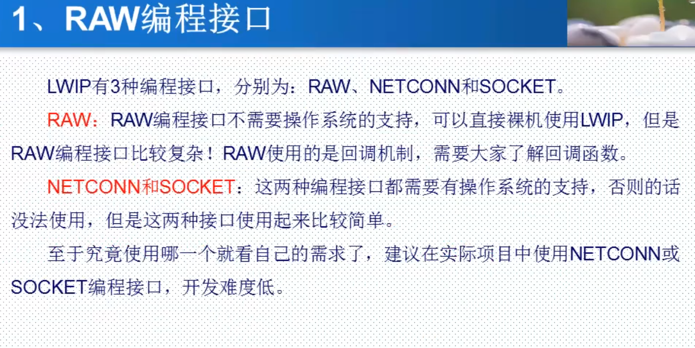
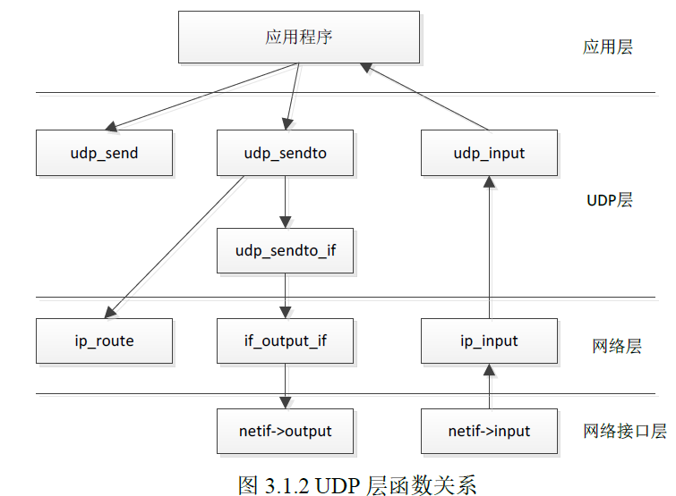
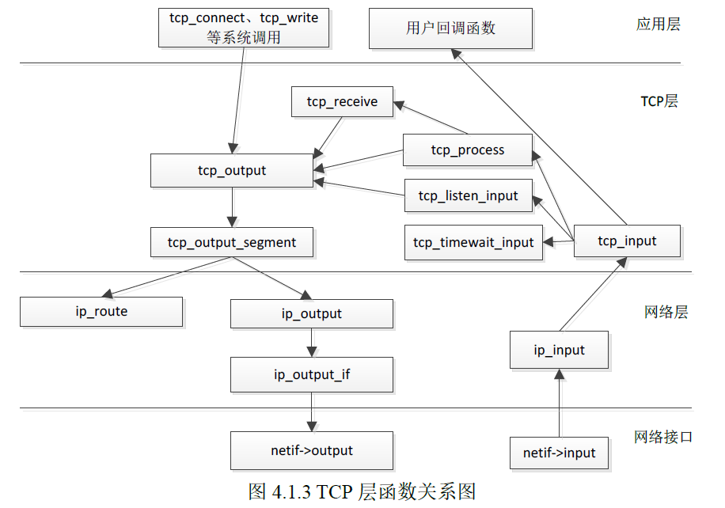
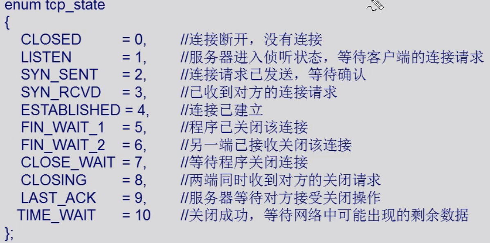
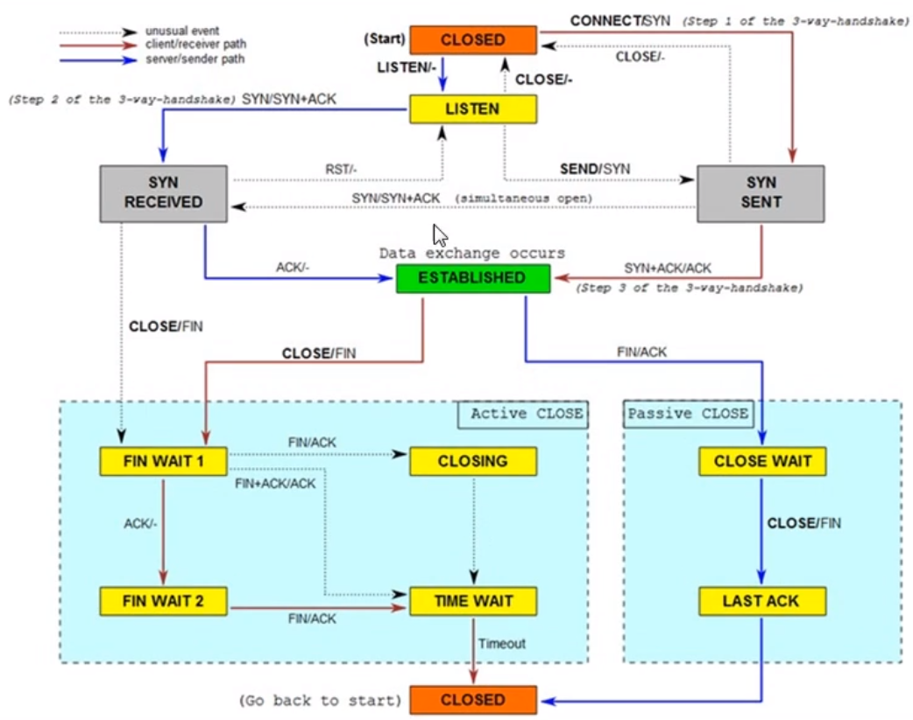
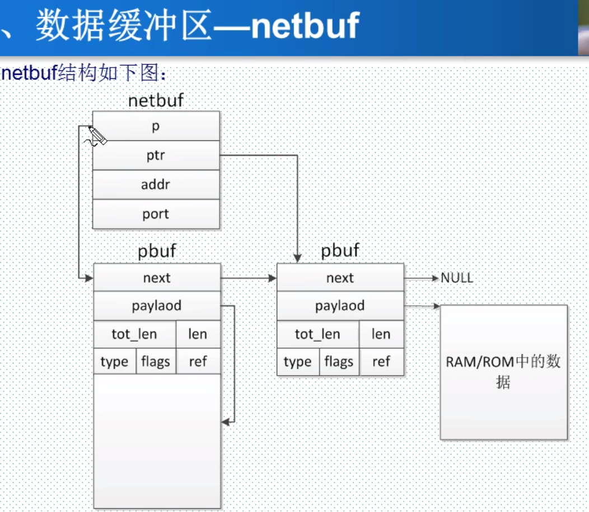
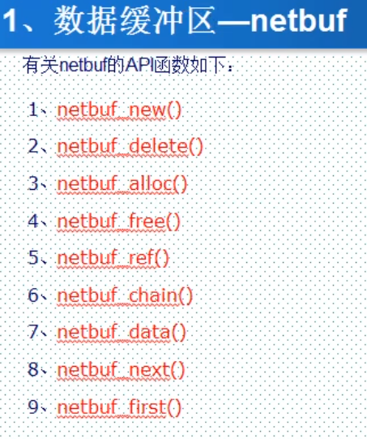
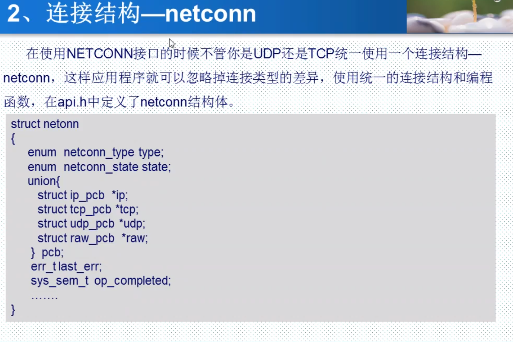
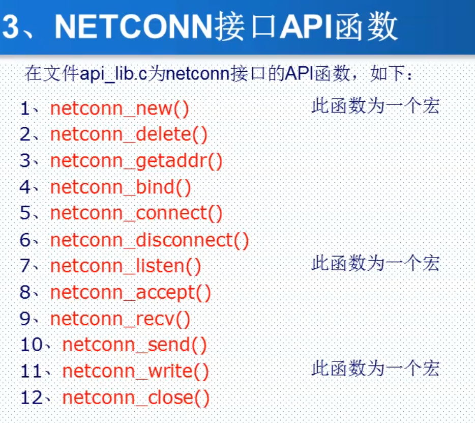
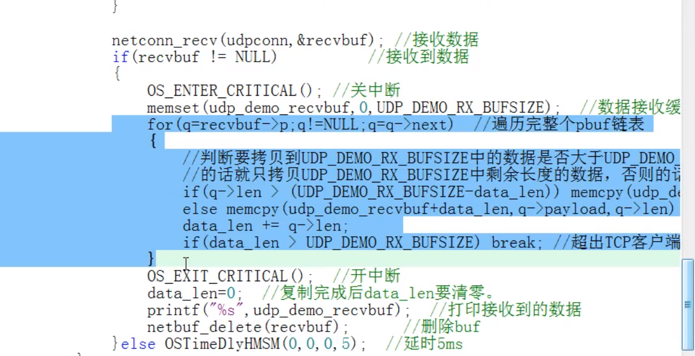

# LWIP

socket需要用到内存拷贝

netconn不需要用到内存拷贝

前两者使用都需要使用操作系统

raw编程方式可以不使用操作系统，主要使用的是回调函数

## 3. RAW编程接口

## 1. LWIP数据包和网络接口管理

### 1.1 LWIP数据包管理

LWIP使用pbuf结构体描述协议栈使用中的数据包，pbuf结构体在pbuf.h中定义

### 1.2 LWIP网络接口管理

netif结构体实现对网络接口的描述，在netif.h中定义

netif_add() 网卡注册函数  把一个netif结构体添加在netif_list中

## 3. RAW编程接口

* LWIP的RAW API编程方式是基于回调机制的，初始化应用时，需要将内核中不同的事件注册相应的回调函数。

### 3.1 UDP简介

1. UDP常用的功能函数

   | RAW API函数      | 说明                                       |
   | -------------- | ---------------------------------------- |
   | udp_new        | 新建udp的pcb控制块                             |
   | udp_remove     | 将一个pcb控制块从链表中删除，并释放该控制块的内存               |
   | udp_bind       | 给udp的pcb控制块绑定一个本地ip地址与端口号                |
   | udp_connect    | 连接指定ip地址的指定端口（设置pcb控制块的remote_ip与remote_port） |
   | udp_disconnect | 断开连接                                     |
   | udp_send       | 通过pcb控制块发送消息                             |
   | udp_recv       | 注册回调函数，接收数据时调用                           |

2.    RAW API编程接口中与UDP相关的函数关系

   

2. 连接流程

   3.1 初始化

   * lwipdev.remoteip[]设置ip
   * udp_new 创建udp的pcb控制块
   * IP4_ADDR ：将lwipdev.remoteip[]的四字节地址设置为ip地址
   * udp_connect：upd客户端连接到指定IP地址和端口号的服务器
   * udp_bind：绑定本地的IP地址与端口号
   * udp_recv：注册接收回调函数
   * 调用LWIP轮询任务，正点原子：lwip_periodic_handle()。
   * lwip_pkt_handle()

   3.2 发送函数

   * udp_send

   3.3 接收到数据后需要调用

   * ethernetif_input()  。
   
   * > 之前在添加网卡(netif_add)时，注册的函数
     >
     > 作用：从网路缓冲区中读取数据包，并发给LWIP处理

   3.3 关闭连接

   * udp_disconnect()断开udp连接

   * udp_remove() 将pcb控制块从链表中删除，释放内存
   * 创建udp时若失败，也需要将其关闭，删除。

### 3.2 TCP简介

1. TCP的RAW API常用函数

<table>
  <tr>
    <th>函数分组</th>
    <th>API函数</th>
    <th>函数功能描述</th>
  </tr>
  <tr>
    <td rowspan="6">TCP建立连接</td>
    <td>tcp_new()</td>
    <td>创建一个TCP的PCB控制块</td>
  </tr>
  <tr>
    <td>tcp_bind()</td>
    <td>为TCP的PCB控制块绑定一个本地的IP地址和端口号</td>
  </tr>
  <tr>
    <td>tcp_listen()</td>
    <td>监听TCP的PCB</td>
  </tr>
  <tr>
    <td>tcp_accept()</td>
    <td>控制块accept字段注册的回调函数，监听到连接时调用</td>
  </tr>
  <tr>
    <td>tcp_accepted()</td>
    <td>通知LIWIP协议栈，一个TCP已经被连接</td>
  </tr>
  <tr>
      <td>tcp_conect()</td>
      <td>连接远程主机</td>
  </tr>
  <tr>
      <td rowspan="3">发送TCP数据</td>
      <td>tcp_write()</td>
      <td>构建一个报文，并放在控制块的发送缓冲队列中</td>
  </tr>
  <tr>
      <td>tcp_sent()</td>
      <td>控制块sent字段注册的回调函数，数据发送成功后被回调</td>
  </tr>
  <tr>
      <td>tcp_output()</td>
      <td>将发送缓冲队列中的数据发送出去</td>
  </tr>
  <tr>
      <td rowspan="2">接收TCP数据</td>
      <td>tcp_recv()</td>
      <td>控制块recv字段注册的回调函数，当接收到新数据时被调用</td>
  </tr>
  <tr>
      <td>tcp_recved()</td>
      <td>当程序处理完数据后一定要调用此函数，通知内核更新接收窗口</td>
  </tr>
  <tr>
      <td>轮询函数</td>
      <td>tcp_poll()</td>
      <td>控制块poll字段注册的回调函数，该函数周期性调用</td>
  </tr>
  <tr>
      <td rowspan="3">关闭和中止连接</td>
      <td>tcp_close()</td>
      <td>关闭TCP连接</td>
  </tr>
  <tr>
      <td>tcp_err()</td>
      <td>控制块err字段注册的回调函数，遇到错误时被调用</td>
  </tr>
  <tr>
      <td>tcp_abort()</td>
      <td>中断TCP连接</td>
  </tr>
</table>

2. RAW API编程接口中与TCP相关的函数关系

3. TCP状态

   * LWIP中在tcp.h中通过枚举类型定义出了TCP的11种状态：tcp_state
* 说明
   * 
   * 状态图

   

3. 连接流程

   3.1 初始化

   * tcp_new()；创建TCP控制块
   * IP4_ADDR ()；设置远端IP地址
   * tcp_connect()；连接到远端IP地址的指定端口号上，连接成功后回调注册的connected参数所对应的函数
     * 建立连接后，回调函数中设置相应函数
     * tcp_arg()：
     * tcp_recv()：
     * tcp_err()：
     * tcp_sent()：
     * tcp_poll()：
   * 调用LWIP轮询任务，正点原子：lwip_periodic_handle()。
   * lwip_pkt_handle()

   

## 4. NETCONN编程方式

### 4.1 简介

netconn_send()函数用于udp连接上发送数据

netconn_write()函数用于tcp连接上发送数据

recv函数是阻塞的，设置超时时间后，便不会阻塞线程

udp

10ms不会丢包

5ms丢包

想要速度更快，把这个遍历拷贝编程以太网转串口，直接写到串口寄存器，串口打印，避免程序中的延时

实际应用时  发送与接收各自创建一个线程任务