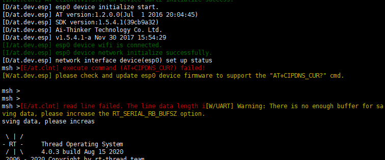
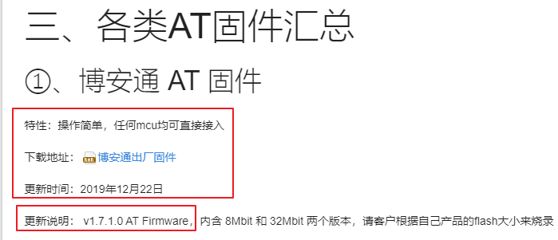

# env使用

[官方手册](https://www.rt-thread.org/document/site/programming-manual/env/env/)

1.构建工程

`scons --target=mdk5  (也可以写其他编译器 例如 mdk4 IAR)`

2.使用内部的gcc编译器

`scons`

## menuconfig

1.添加软件包

* 在menuconfig中选择软件包侯，保存退出
* 输入`pkgs --update`
* 重新构建工程`scons --target=mdk5`

2.env配置

`menuconfig -s`

3.全局搜索

按下 / 是搜索

4.选项说明

shift + ? 可以查看该选项的解释

# 联网

## 连接OneNet

[官方参考文档](https://www.rt-thread.org/document/site/tutorial/qemu-network/onenet/onenet/#_1)

* 修改`rtconfig.h`中关于WiFi与OneNet的配置信息

```C
/* Wiced WiFi */
#define PKG_USING_AT_DEVICE
#define AT_DEVICE_USING_ESP8266
#define AT_DEVICE_ESP8266_SAMPLE
#define ESP8266_SAMPLE_WIFI_SSID "rtthread"
#define ESP8266_SAMPLE_WIFI_PASSWORD "12345678"
#define ESP8266_SAMPLE_CLIENT_NAME "uart2"
#define ESP8266_SAMPLE_RECV_BUFF_LEN 512
#define PKG_USING_AT_DEVICE_V203
#define PKG_AT_DEVICE_VER_NUM 0x20003

/* IoT Cloud */
#define PKG_USING_ONENET
#define PKG_USING_ONENET_SAMPLE          //开启 OneNET 示例代码
#define ONENET_USING_MQTT                //开启 MQTT 协议连接 OneNET 支持
#define ONENET_INFO_DEVID "29573339"     //设备ID
#define ONENET_INFO_AUTH "EF4016D6658466CA3E3606"            //鉴权信息
#define ONENET_INFO_APIKEY "a2gVVf1hggZfuATkNogulHK1V=s="    //配置云端创建设备时获取的 APIkey
#define ONENET_INFO_PROID "131494"      //产品ID 
#define ONENET_MASTER_APIKEY "U=wJJ=OEpZsZEHmdPrsKwH2hFYw="  //产品APIKey
#define PKG_USING_ONENET_LATEST_VERSION
```


## esp8266
### 遇见的问题
1.没有`AT+CIPDNS_CUR?`命令  
   
解决：  更新esp8266固件  

 * 使用安信可固件  
   [固件下载](https://docs.ai-thinker.com/esp8266)  
     使用`博安通 AT 固件`固件  
      

 * 使用乐鑫固件  
     [固件下载](https://www.espressif.com/zh-hans/support/download/at?keys=)

     [官方文档说明](https://docs.espressif.com/projects/esp-at/en/latest/AT_Binary_Lists/index.html)

     网上说使用ESP8266-IDF-AT_V2.1.0.0版本

     官网说使用该版本下的factory_xxx.bin，烧录在0地址下

     本人烧录未成功
