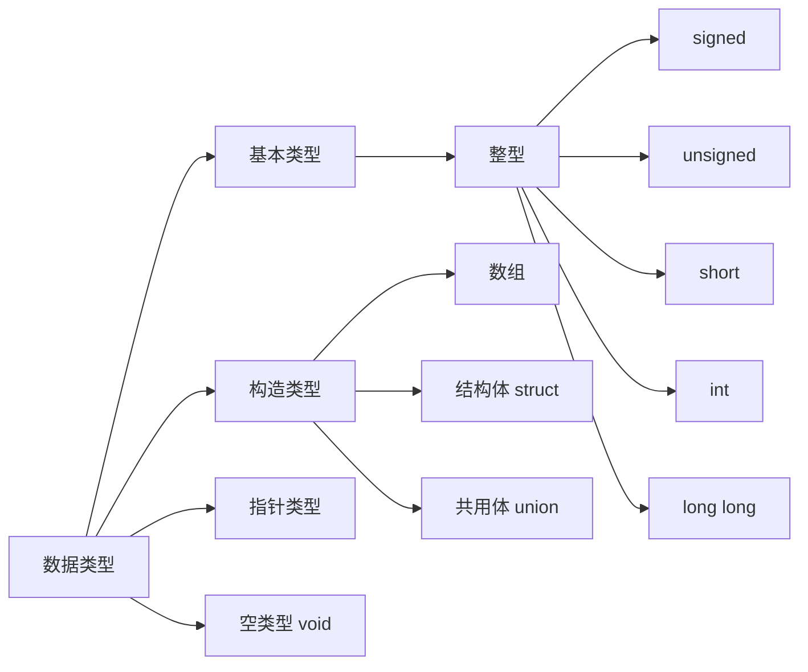

# 1. 数据类型


## 1.1 字节

| 类型      | 字节   |                |
| ------- | ---- | -------------- |
| byte    | 1    | 最小值-127($2^7$) |
| boolean | 1    |                |
| short   | 2    |                |
| char    | 2    |                |
| int     | 4    |                |
| float   | 4    |                |
| long    | 8    |                |
| double  | 8    |                |

# 2. 关键字
## 2.1 volite
### 定义
volatile是一个类型修饰符（type specifier）.volatile的作用是作为指令关键字，确保本条指令不会因编译器的优化而省略，且要求每次直接读值。volatile的变量是说这变量可能会被意想不到地改变，这样，编译器就不会去假设这个变量的值了。
### 说明
一个定义为volatile的变量是说这变量可能会被意想不到地改变，这样，编译器就不会去假设这个变量的值了。精确地说就是，优化器在用到这个变量时必须每次都小心地重新读取这个变量的值，而不是使用保存在寄存器里的备份。

示例：   
1. 并行设备的硬件寄存器（如：状态寄存器）  
2. 一个中断服务子程序中会访问到的非自动变量(Non-automatic variables)   
3. 多线程应用中被几个任务共享的变量    
4. 防止被编译器优化，入for循环延时程序。   
### 具体例子
1.一个参数既可以是const还可以是volatile吗？解释为什么？

* 是的。一个例子是只读的状态寄存器。它是volatile因为它可能被意想不到地改变。它是const因为程序不应该试图去修改它。

2.一个指针可以是volatile 吗？解释为什么？ 

* 是的。尽管这并不很常见。一个例子是当一个中服务子程序修该一个指向一个buffer的指针时。

3.下面的函数有什么错误：   

```C
int square(volatile int *ptr)
{
  return ptr *ptr;
}
```

* 这段代码的目的是用来返指针*ptr指向值的平方，但是，由于*ptr指向一个volatile型参数，编译器将产生类似下面的代码：   
```C
int square(volatile int *ptr)
{
  int a,b;
  a = *ptr;
  b = *ptr;
  return a * b;
}
```

* 由于*ptr的值可能被意想不到地该变，因此a和b可能是不同的。结果，这段代码可能返不是你所期望的平方值！正确的代码如下：   
```C
int square(volatile int *ptr)
{
  int a;
  a = *ptr;
  return a * a;
}
```
## 2.2 register

* 为了提高效率，C语言允许将局部变量得值放在 CPU中的寄存器中，这种变量叫`寄存器变量`，用关键字register作声明。

> 1. 只有局部自动变量和形式参数可以作为寄存器变量
> 2. 一个计算机中的寄存器变量有限，不能随意定义寄存器变量
> 3. 局部静态变量不能定义为寄存器变量

## 2.3 const

* const 只读

* 使用const理由：

    1.关键字const的作用是为给读你代码的人传达非常有用的信息，实际上，声明一个参数为常量是为了告诉了用户这个参数的应用目的。不希望参数被修改。

    2.通过给优化器一些附加的信息，使用关键字const也许能产生更紧凑的代码。

    3.合理地使用关键字const可以使编译器很自然地保护那些不希望被改变的参数，防止其被无意的代码修改。

* 用法：

    ```C
    const int a0;          //a0是常整数
    int const a1;          //a1是常整数
    const int *a;          //a不是const，而a指向的int型变量是const的
    int const *b;          //b不是const，而b指向的int型变量是const的
    int *const c;          //c指针是const的，而c指向的变量不是const的
    const int * const d;   //d指针是const的，且d指向的变量也是const的
    ```

* const修饰的变量是否可以修改？

    1. 其实是可以修改的（在GCC环境下（不确定））  
    2. 在一些单片机编译环境下，const是不可以修改的，是否可以修改，要根据具体的编译环境   
    3. 在GCC的编译环境下，const是通过编译器在编译时对其进行检查（也就是说，const类型变量如果修改只是编译错误，并不是运行时的错误。只要能够骗过编译器，就可以修改const定义的变量，而且运行时候不会报错）    
    4. 因为GCC在编译时，把const类型变量放在了data段。其实与普通的全局变量放在data段是一样的实现过程，只要通过编译器认定这个变量是const的，运行时不标记为const类型，就可以达到修改const变量的目的 

        * C语言中，const修饰的变量是伪常量，编译器会对其分配内存。
        * C++中，编译器不会对const类型数据分配内存 

    5. 示例：
    ```C
    //示例以一：有警告
    const int a = 6;
    //a = 10;           //直接赋值会报错：assignment of read-only variable
    int *p;
    p = &a;
    *p = 10;
    printf("a = %d \r\n", a);

    //示例以二：无警告
    const int a = 6;
    //a = 10;           //直接赋值会报错：assignment of read-only variable
    int *p;
    p = (int *)&a;
    *p = 10;
    printf("a = %d \r\n", a);
    ```


# 3. 预处理

## 3.1 条件编译

1. 条件编译中使用的两种条件判定方法分别是`#if`和`ifdef`

## 3.2 #define

  1. 尽量使用const 替换 #define

    1.1 在旧版本的C中，若定义一个常量必须使用预处理器`#define MAX 1024`，MAX宏定义在预处理阶段就被替换为1024。因此，MAX并没有被加入到符号定义中。如果在程序中运用这个常量获得到一个编译错误时，这时提示信息可能会是1024,而不是MAX.因此查找起来需要花费时间。解决办法就是使用const：`const int MAX = 1024`  

  2. const与#define区别

    2.1 const是有类型的，可以进行编译器类型安全检查；#define是没有类型的，不能进行类型检查。

    2.2 const有作用域；#define不重视作用域，默认定义处到文件结尾。如果需要定义一个在指定作用域下有效的变量，那么不能使用#deifne。

    ​