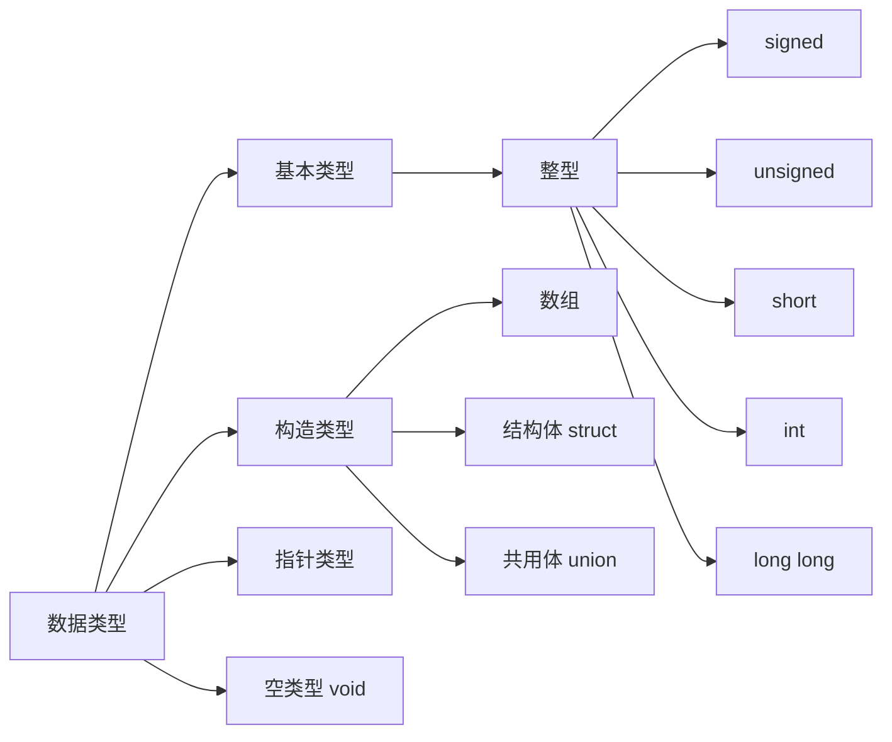

# 1. 数据类型


## 1.1 字节

| 类型      | 字节   |                |
| ------- | ---- | -------------- |
| byte    | 1    | 最小值-127($2^7$) |
| boolean | 1    |                |
| short   | 2    |                |
| char    | 2    |                |
| int     | 4    |                |
| float   | 4    |                |
| long    | 8    |                |
| double  | 8    |                |

# 2. 关键字
## 2.1 volite
### 定义
volatile是一个类型修饰符（type specifier）.volatile的作用是作为指令关键字，确保本条指令不会因编译器的优化而省略，且要求每次直接读值。volatile的变量是说这变量可能会被意想不到地改变，这样，编译器就不会去假设这个变量的值了。
### 说明
* 一个定义为volatile的变量是说这变量可能会被意想不到地改变，这样，编译器就不会去假设这个变量的值了。精确地说就是，优化器在用到这个变量时必须每次都小心地重新读取这个变量的值，而不是使用保存在寄存器里的备份。
* 示例
1. 并行设备的硬件寄存器（如：状态寄存器）
2. 一个中断服务子程序中会访问到的非自动变量(Non-automatic variables)
3. 多线程应用中被几个任务共享的变量
4. 防止被编译器优化，入for循环延时程序。
### 具体例子
1. 一个参数既可以是const还可以是volatile吗？解释为什么？
* 是的。一个例子是只读的状态寄存器。它是volatile因为它可能被意想不到地改变。它是const因为程序不应该试图去修改它。
2. 一个指针可以是volatile 吗？解释为什么？
* 是的。尽管这并不很常见。一个例子是当一个中服务子程序修该一个指向一个buffer的指针时。
3. 下面的函数有什么错误：
```C
int square(volatile int *ptr)
{
  return ptr *ptr;
}
```
* 这段代码的目的是用来返指针*ptr指向值的平方，但是，由于*ptr指向一个volatile型参数，编译器将产生类似下面的代码：
```C
int square(volatile int *ptr)
{
  int a,b;
  a = *ptr;
  b = *ptr;
  return a * b;
}
```
* 由于*ptr的值可能被意想不到地该变，因此a和b可能是不同的。结果，这段代码可能返不是你所期望的平方值！正确的代码如下：
```C
int square(volatile int *ptr)
{
  int a;
  a = *ptr;
  return a * a;
}
```
## 2.2 register
* 为了提高效率，C语言允许将局部变量得值放在 CPU中的寄存器中，这种变量叫`寄存器变量`，用关键字register作声明。

> 1. 只有局部自动变量和形式参数可以作为寄存器变量
> 2. 一个计算机中的寄存器变量有限，不能随意定义寄存器变量
> 3. 局部静态变量不能定义为寄存器变量