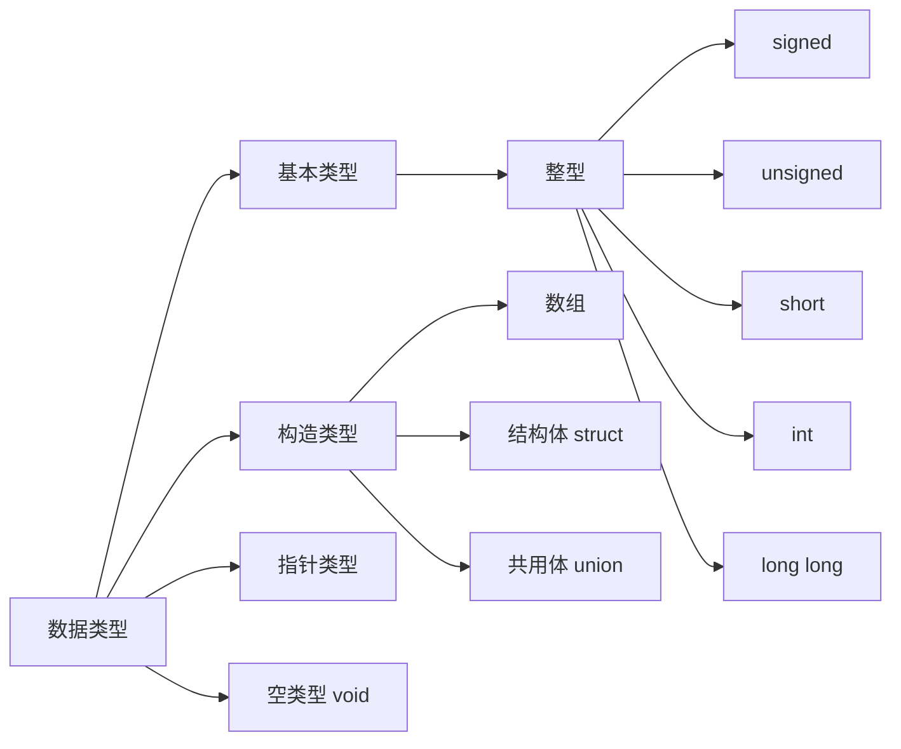
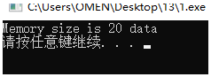
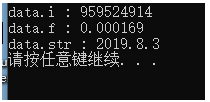
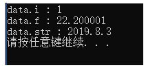

# 1. 数据类型


### 1.1 字节

| 类型      | 字节   |                |
| ------- | ---- | -------------- |
| byte    | 1    | 最小值-127($2^7$) |
| boolean | 1    |                |
| short   | 2    |                |
| char    | 2    |                |
| int     | 4    |                |
| float   | 4    |                |
| long    | 8    |                |
| double  | 8    |                |

# 2. 关键字
### 2.1 volite
#### 定义
volatile是一个类型修饰符（type specifier）.volatile的作用是作为指令关键字，确保本条指令不会因编译器的优化而省略，且要求每次直接读值。volatile的变量是说这变量可能会被意想不到地改变，这样，编译器就不会去假设这个变量的值了。
#### 说明
一个定义为volatile的变量是说这变量可能会被意想不到地改变，这样，编译器就不会去假设这个变量的值了。精确地说就是，优化器在用到这个变量时必须每次都小心地重新读取这个变量的值，而不是使用保存在寄存器里的备份。

示例：   
1. 并行设备的硬件寄存器（如：状态寄存器）  
2. 一个中断服务子程序中会访问到的非自动变量(Non-automatic variables)   
3. 多线程应用中被几个任务共享的变量    
4. 防止被编译器优化，入for循环延时程序。   
#### 具体例子
1.一个参数既可以是const还可以是volatile吗？解释为什么？

* 是的。一个例子是只读的状态寄存器。它是volatile因为它可能被意想不到地改变。它是const因为程序不应该试图去修改它。

2.一个指针可以是volatile 吗？解释为什么？ 

* 是的。尽管这并不很常见。一个例子是当一个中服务子程序修该一个指向一个buffer的指针时。

3.下面的函数有什么错误：   

```C
int square(volatile int *ptr)
{
  return ptr *ptr;
}
```

* 这段代码的目的是用来返指针*ptr指向值的平方，但是，由于*ptr指向一个volatile型参数，编译器将产生类似下面的代码：   
```C
int square(volatile int *ptr)
{
  int a,b;
  a = *ptr;
  b = *ptr;
  return a * b;
}
```

* 由于*ptr的值可能被意想不到地该变，因此a和b可能是不同的。结果，这段代码可能返不是你所期望的平方值！正确的代码如下：   
```C
int square(volatile int *ptr)
{
  int a;
  a = *ptr;
  return a * a;
}
```
### 2.2 register

* 为了提高效率，C语言允许将局部变量得值放在 CPU中的寄存器中，这种变量叫`寄存器变量`，用关键字register作声明。

> 1. 只有局部自动变量和形式参数可以作为寄存器变量
> 2. 一个计算机中的寄存器变量有限，不能随意定义寄存器变量
> 3. 局部静态变量不能定义为寄存器变量

### 2.3 const

* const 只读

* 使用const理由：

    1.关键字const的作用是为给读你代码的人传达非常有用的信息，实际上，声明一个参数为常量是为了告诉了用户这个参数的应用目的。不希望参数被修改。

    2.通过给优化器一些附加的信息，使用关键字const也许能产生更紧凑的代码。

    3.合理地使用关键字const可以使编译器很自然地保护那些不希望被改变的参数，防止其被无意的代码修改。

* 用法：

    ```C
    const int a0;          //a0是常整数
    int const a1;          //a1是常整数
    const int *a;          //a不是const，而a指向的int型变量是const的
    int const *b;          //b不是const，而b指向的int型变量是const的
    int *const c;          //c指针是const的，而c指向的变量不是const的
    const int * const d;   //d指针是const的，且d指向的变量也是const的
    ```

* const修饰的变量是否可以修改？

    1. 其实是可以修改的（在GCC环境下（不确定））  
    2. 在一些单片机编译环境下，const是不可以修改的，是否可以修改，要根据具体的编译环境   
    3. 在GCC的编译环境下，const是通过编译器在编译时对其进行检查（也就是说，const类型变量如果修改只是编译错误，并不是运行时的错误。只要能够骗过编译器，就可以修改const定义的变量，而且运行时候不会报错）    
    4. 因为GCC在编译时，把const类型变量放在了data段。其实与普通的全局变量放在data段是一样的实现过程，只要通过编译器认定这个变量是const的，运行时不标记为const类型，就可以达到修改const变量的目的 

        * C语言中，const修饰的变量是伪常量，编译器会对其分配内存。
        * C++中，编译器不会对const类型数据分配内存 

    5. 示例：
    ```C
    //示例以一：有警告
    const int a = 6;
    //a = 10;           //直接赋值会报错：assignment of read-only variable
    int *p;
    p = &a;
    *p = 10;
    printf("a = %d \r\n", a);

    //示例以二：无警告
    const int a = 6;
    //a = 10;           //直接赋值会报错：assignment of read-only variable
    int *p;
    p = (int *)&a;
    *p = 10;
    printf("a = %d \r\n", a);
    ```

### 2.4 typedef

* `typedef`与`#define`区别

    * `typedef`仅限于为类型定义符号名称。`#define`不仅可以为类型定义别名，也可以为数值定义别名。
    * `typedef`是由编译器解释执行的，`#define`是由预编译器进行处理的。

    * 原理不同：

        * `#define`是C语言中定义的语法，是预处理指令，在预处理时进行简单而机械的字符串替换，不作正确性检查，只有在编译已被展开的源程序时才会发现可能的错误并报错。
        * `typedef`是关键字，在编译时处理，有类型检查功能。它在自己的作用域内给一个已经存在的类型一个别名，但不能在一个函数定义里面使用typedef。用typedef定义数组、指针、结构等类型会带来很大的方便，不仅使程序书写简单，也使意义明确，增强可读性。

    * 功能不同：

        * `typedef`用来定义类型的别名，起到类型易于记忆的功能。另一个功能是定义机器无关的类型。如定义一个REAL的浮点类型，在目标机器上它可以获得最高的精度：typedef long double REAL， 在不支持long double的机器上，看起来是这样的，typedef double REAL，在不支持double的机器上，是这样的，typedef float REAL
        * `#define`不只是可以为类型取别名，还可以定义常量、变量、编译开关等。

    * 作用域不同：

        * `typedef`如果放在所有函数之外，它的作用域就是从它定义开始直到文件尾；如果放在某个函数内，定义域就是从定义开始直到该函数结尾；
        * `#define`不管是在某个函数内，还是在所有函数之外，作用域都是从定义开始直到整个文件结尾。

    * 对指针的操作不同：

        * 示例：
            ```C
            #define INTPTR1 int*
            typedef int* INTPTR2;

            INTPTR1 p1, p2;
            INTPTR2 p3, p4;

            将它们转换后：
            int*p1, p2
            INTPTR2 p3, p4;
            含义分别为:

            声明一个指针变量p1和一个整型变量p2
            声明两个指针变量p3、p4
            ```


# 3. 预处理

  * 凡是以`#`开头的均为预处理命令。

### 3.1 条件编译

1. 条件编译中使用的两种条件判定方法分别是`#if`和`ifdef`

### 3.2 #define

  1. 无参宏定义

    * 无参宏定义后不带参数：`#define 标识符字符串`
        * `define`为宏定义命令
        * `标识符`为定义的宏名
        * `字符串`可以是常数，表达式，格式串等等
    * 注意：
        * 宏定义只是一种简单的替换，预处理时对它不做任何的检查。因此，若有错误只能在编译阶段发现。
        * 宏定义不是说明或语句，在行末不需要加分号，若加分号会将分号一起替换。
        * 宏定义必须写在函数之外，其作用域为宏定义命令起到源程序结束。若想终止其作用域可以使用`#undef`命令
        * 宏名若在源程序中用引号括起来，则预处理程序不对其进行宏替换。
        * 宏定义允许嵌套，在宏定义的字符串中可以使用已经定义的宏。在宏展开时，由预处理程序层层替换。
          ```C
          #define PI 3.1415926
          #define S (PI * y * y)
          ```
        * 习惯使用大写表示宏，以便与变量进行区别。也允许使用小写。
        * 可以使用宏定义表示数据类型
          ```C
          #define STU struct stu
          STU a;
          ```

  2. 带参宏定义

    * 在宏定义中的参数为形式参数；在宏调用中的参数为实际参数。
        * 对于带参数的宏，在调用中，不仅要宏展开，而且要用实参去替代形参
        * 带参宏定义一般格式：`#define 宏名(形参) 字符串`
        * 带参宏调用一般形式：`宏名(形参)`
          ```C
          #define M(y) y*y+3*y    //定义
          int k;
          k = M(5);               //调用
          //预处理后的结果：
          k = 5*5+3*5
          ```
    * 注意：
        * 带参宏定义，宏名与形参之间不能有空格出现
          ```C
          //正确
          #define MAX(a, b) (a > b)?a:b
          //错误
          #define MAX (a, b) (a > b)?a:b
          ```
        * 在带参宏定义中，形参不分配内存单元。因此不必做类型定义。而宏调用中的实参要有具体的值。要用他们去替代形参，因此必须做类型说明。`这是与函数不同的：在函数中，形参和实参是两个不同的量，有各自的作用域，调用时要把实参值赋予形参，进行“值传递”。而带参宏中，只是符号代换，不存在值传递的问题。`


  3. 尽量使用const 替换 #define

    3.1 在旧版本的C中，若定义一个常量必须使用预处理器`#define MAX 1024`，MAX宏定义在预处理阶段就被替换为1024。因此，MAX并没有被加入到符号定义中。如果在程序中运用这个常量获得到一个编译错误时，这时提示信息可能会是1024,而不是MAX.因此查找起来需要花费时间。解决办法就是使用const：`const int MAX = 1024`  

  4. const与#define区别

    4.1 const是有类型的，可以进行编译器类型安全检查；#define是没有类型的，不能进行类型检查。

    4.2 const有作用域；#define不重视作用域，默认定义处到文件结尾。如果需要定义一个在指定作用域下有效的变量，那么不能使用#deifne。

### 3.3 头文件包含

  * `#include <>`与`#include ""`区别

      * <>包含系统文件。例如：c库文件（不是程序员写的库文件）。<> 只会到系统指定的路径下找相应的库文件（隐含意思：不会在当前路径下去寻找），找不到就会提示该文件不存在。
      * " "包含自己写的头文件。" " 现在当前路径下寻找，若没有找到 会到系统指定的路径下寻找，如果没找到 会提示该文件不存在。

  * 头文件包含的真实含义:

      * 在#include<xx.h>的那一行，将xx.h这个文件的内容原地展开，替换#include<xx.h>这行语句。处理过程在`预处理`中进行。

# 4. 共用体union

  * 共用体是一种特殊的数据类型，`允许在相同的内存位置存储不同的数据类型`。一个具有多成员的共用体，任何时候只能有一个成员带有值。共用体提供了一种使用相同的内存位置的有效方式。

  * 定义共用体：
      ```C
      union Data {
        int i;
        float f;
        char str[20];
      }data;
      ```

  * `共用体占用的内存应该足够存储共用体中最大的成员变量，即共用体的内存是其中所占字节最大的数据类型（结构体所占内存是所有变量之和）`。例如：上面示例中，Data将占用20个字节的内存空间。因为在各个成员中，字符串所占的空间是最大的。
      ```C
      //输出Data所占字节空间
      #include <stdio.h>
      #include <string.h>
       
      union Data {
         int i;
         float f;
         char  str[20];
      };
       
      int main( ) {
         union Data data;        
       
         printf( "Memory size occupied by data : %d\n", sizeof(data));
       
         return 0;
      }
      ```
      

  * 使用示例：

      ```C
      //同时使用
      #include <stdio.h>
      #include <string.h>
      #include<stdlib.h>

      union Data {
          int i;
          float f;
          char str[20];
      };

      int main() {
          union Data data;

      /****************重点******************/
         data.i = 1;
         data.f = 22.2;
         strcpy(data.str,"2019.8.3");

         printf("data.i : %d\n",data.i);
         printf("data.f : %f\n",data.f);
         printf("data.str : %s\n",data.str);
      /****************重点******************/   
         
         system("pause");
      }
      ```
      
      
      * 我的理解：因为共用体的所有变量使用的是同一个内存，所以f会把i的定义覆盖，同理，str会把f的覆盖。  
      * 菜鸟教程说明：在这里，我们可以看到共用体的 i 和 f 成员的值有损坏，因为最后赋给变量的值占用了内存位置，这也是 str 成员能够完好输出的原因。

      ```C
      //分开使用
      #include <stdio.h>
      #include <string.h>
      #include<stdlib.h>
    
      union Data {
          int i;
          float f;
          char str[20];
      };
    
      int main() {
          union Data data;
    
      /****************重点******************/
          data.i = 1;
          printf("data.i : %d\n",data.i);
    
          data.f = 22.2;
          printf("data.f : %f\n",data.f);
    
          strcpy(data.str,"2019.8.3");
          printf("data.str : %s\n",data.str);
      /****************重点******************/   
         
         system("pause");
      }
      ```
       